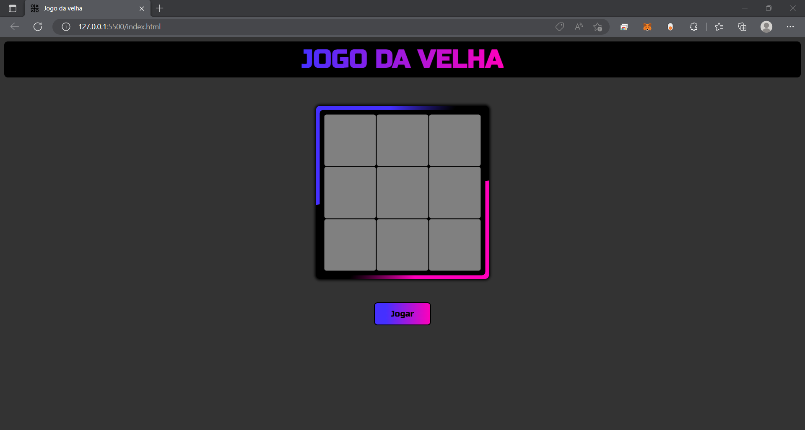
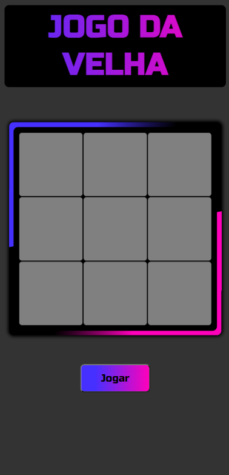
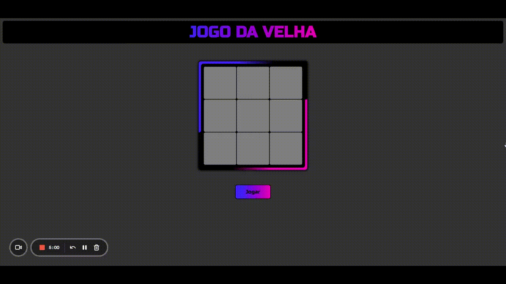

# 📋 Projeto Jogo da Velha

## 💎 Introdução

 A regra é simples, quem conseguir preencher primeiro uma fileira seja na horizontal, vertical ou diagonal, vence! 
 
O projeto que você verá a seguir consiste em um jogo da velha, no qual dois players podem jogar e testar suas habilidades no jogo, assim como testei minhas habilidades com HTML, CSS e JavaScript na construção do projeto. Espero que gostem!

## 💻 Layout Web

## 📱 Layout Mobile

## 🎥 Animação

# ✅ Tecnologias
* HTML 5
* CSS 3
* JavaScript

# 📝 Autor
https://www.linkedin.com/in/kauan-borotto-7904401a3/